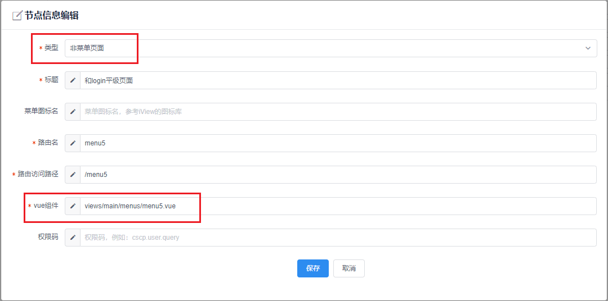

# 比翼前端模板新版本说明（v4.4.1）

## 目录
1. 版本说明
2. 升级说明 **(新增)**
3. 如何引用biyi-admin组件
4. 如何配置页面的静态路由
5. 如何配置页面的异步路由
6. 如何控制按钮级权限
7. 旧项目迁移到新模板里的注意事项
8. 项目编译后如何使用外挂配置文件替换util中的属性 **(新增)**
9. i18n国际化配置
10. 其他

### 一、版本说明

  v4.4.1版本做了如下改变：
  
  - 新增配置文件config.js，可以在编译打包后修改util的属性
  - 新增比翼微服务的配置文件
  - 优化了sider-menu-shrinked.vue和sider-menu.vue组件

### 二、升级说明
*注意：该部分只介绍如何将上一个版本如何升级到当前版本。*

- 升级适用版本号：v4.4.0
- 升级说明：
**（1）如何添加config配置文件**
  
  - 第一，添加public/configs/config.js文件
  - 第二，在util.js中添加如下代码：
  ```
  const util = {}
  //*************************以下是要添加的代码***************************
  // read env from configs file
  const env = window['$env'] ? window['$env'] : process.env.NODE_ENV

  util.baseUrl = env === 'development' ? 'http://localhost:9000' : 'http://localhost:9000'

  // 将需要外挂文件覆盖的属性写在该函数执行前
  loadConfigs()
  //*************************以上是要添加的代码***************************
  util.http = axios.create({
    baseURL: util.baseUrl,
    timeout: 5000
  })
  ```
  ```
  // 在util.js中添加loadConfig方法
  function loadConfigs () {
    // load api from config file
    Object.keys(window).forEach(key => {
      if (key.startsWith('$')) {
        if (window[key]) {
          util[key.slice(1)] = window[key]
        }
        delete window[key]
      }
    })
  }
  ```
  - 第三，config里的使用规则参考 **第八章**。
  
  **（2）如何添加比翼微服务的配置文件**
  
  - 第一，安装插件
  ```
  // 记得将npm仓库地址切换为比翼的仓库地址
  npm install --save-dev write-files-before-compiler-run
  ```
  - 第二，在vue.config.js中配置插件
  ```
  // 引入
  const writeFilesBeforeCompilerRun = require("write-files-before-compiler-run")
  // 配置
  config.plugin('writeFilesBeforeCompilerRun').use(new writeFilesBeforeCompilerRun([
    {
      fileName: 'micro-service-config.js',
      path: 'public/configs',
      content: ''
    },
    {
      fileName: 'index.html',
      path: 'public',
      content: indexHtml
    }
  ]))
  ```
  - 第三，在项目根目录下添加index.html.js文件，然后在vue.config.js中引入
  ```
  // index.html.js代码
  module.exports = `<!DOCTYPE html><html lang="en">
  <head>
    <meta charset="utf-8" />
    <meta http-equiv="X-UA-Compatible" content="IE=edge" />
    <meta name="viewport" content="width=device-width,initial-scale=1.0" />
    <link rel="icon" href="<%= BASE_URL %>favicon.ico" />
    <title>比翼前端模板工程</title>
  </head>
  <body>
    <noscript>
      <strong
        >We're sorry but biyi-framework-web doesn't work properly without
        JavaScript enabled. Please enable it to continue.</strong
      >
    </noscript>
    <div id="app"></div>
    <script src="./configs/config.js"></script>
    <script src="./configs/micro-service-config.js"></script>
    <!-- built files will be auto injected -->
  </body></html>`
  ```
  ```
  // 引入
  const indexHtml = require("./index.html")
  ```
 
 **（3）如何优化sider-menu-shrinked.vue和sider-menu.vue组件**

  详见比翼帮助平台-开发框架-版本说明，提供相关.vue文件，直接替换即可（如果未修改过这两个文件）。

### 三、如何引用biyi-admin组件
*注意：以下步骤生成工程时自动会执行，无需手动操作。这里说明只是为了如果根据自身业务需要移除或修改时，需要在哪里修改。*

- 安装biyi-admin相关组件包

```
npm install --save biyi-admin biyi-captcha
```

- 在router.js里进行引用，并调用相关方法

```
import initAsyncRouter from 'biyi-admin'

// 在路由全局守卫中调用相关方法，具体逻辑请看相关源码
// 重新获取异步菜单和权限数据
initAsyncRouter().then(() => {
  next(router.resolve(to).route.fullPath)
}).catch(() => {
  next('/login')
})
```

### 四、如何配置页面的静态路由

*注意：为保证程序能够正确解析数据，请严格按照下面说明的数据结构进行静态路由的配置。*

我们将菜单页面和非菜单页面放在同一个数据结构了，然后根据不同的属性来判断来数据对应的是否是菜单页面。
具体请参考用下面的数据结构（router/static-routes.js）：

- 第一种，路由出口在App.vue

```
const singleRoutes = [
  {
    // 设置初始页面
    path: '',
    redirect: '/login'
  },
  {
    path: '/login',
    name: 'login',
    component: login
  },
  {
    path: '/404',
    name: '404',
    component: () => import('../views/error-pages/404.vue')
  }
]
```

说明：如果不想使用biyi-admin默认的登录页面，可以使用自己的项目登录页面替换。方法是：

```
// 在static-router.js的最上方的引入 import { login } from 'biyi-admin' 替换实际的login引入就行
// 例：
import login from 'views/login.vue'

```

- 第二种，路由出口在main.vue


```
/**
** 对于出口在main.vue，又分为了三种数据：
** （1）一级菜单，对应的component固定为'../views/main/main.vue'
** （2）二级菜单，又可以细分为包含三级菜单和不包含三级菜单的。其中不包含三级菜单的component就实际对应一个.vue文件；而包含三级菜单的，此二级菜单并没有实际对应的.vue文件，所有对应的url和component需要为空！
** （3）不在菜单显示的页面，这种数据component有实际对应的.vue文件，但是type类型为非menu（只要menu属性!=='menu'就行）
**
**  注意事项：
** （1）如果children长度为1，那么菜单显示的标题以children[0]的为准
** （2）如果子path属性以'/'开头，则会替换父path;反之则是在父path后自动拼接。例如下例：home对应的路由路径为'/home'，而不是'/home_index/home'
** （3）所有数据都要设置name和title属性
** （4）菜单数据type属性值一定为'menu'，非菜单数据可以不设置type属性或是非'menu'的值
** （5）如果二级菜单下还包含三级菜单，那么该二级菜单的数据中path和component属性一定不要设置或是设为空串
*/

// 下方是一个比较完整的静态路由示例
const staticTree = [
  {
    path: '/home_index',
    name: 'home_index',
    title: '首页',
    icon: 'ios-paper',
    type: 'menu',
    component: () => import('../views/main/main.vue'),
    children: [
      {
        path: '/home',
        name: 'home',
        title: '首页',
        icon: 'ios-paper',
        type: 'menu',
        component: () => import('../views/home/home.vue')
      }
    ]
  },
  {
    path: '/level1',
    name: 'level1',
    title: '一级菜单',
    icon: 'ios-paper',
    type: 'menu',
    component: () => import('../views/main/main.vue'),
    children: [
      {
        path: 'level2-1',
        name: 'level2-1',
        title: '二级菜单-1',
        icon: 'ios-paper',
        type: 'menu',
        component: () => import('../views/home/home.vue')
      },
      {
        path: '',
        name: 'level2-2',
        title: '二级菜单-2',
        icon: 'ios-paper',
        type: 'menu',
        component: '',
        children: [
          {
            path: 'level3',
            name: 'level3',
            title: '三级菜单',
            icon: 'ios-paper',
            type: 'menu',
            component: () => import('../views/test/level3.vue')
          },
          {
            path: 'non-menu-page',
            name: 'non-menu-page',
            title: '非菜单页面',
            component: () => import('../views/test/non-menu-page.vue')
          }
        ]
      }
    ]
  },
  // 非菜单页面也可以这么配，只要是挂载在一个component为main.vue的结构下就行，具体可以根据需要进行处理，区别就是显示的路径可能不太一样，如果需要覆盖掉父级路径，可以将子path属性以'/'开头
  {
    path: '/main',
    name: 'main',
    component: () => import('../views/main/main.vue'),
    children: [
      {
        path: 'non-menu-page',
        name: 'non-menu-page',
        title: '非菜单页面',
        component: () => import('../views/test/non-menu-page.vue')
      }
    ]
  }
]
```

### 五、如何配置页面的异步路由

*注意：要使用页面路由异步化，需要使用biyi-admin组件；如需根据自身业务自行实现，已提供相关源码，可作参考。*

**第一步 新建相关.vue页面文件**

**第二步 在异步路由管理页面进行配置**

页面的异步路由配置位置：权限管理 => 异步路由管理 （注意：你的角色首先要拥有该页面访问权限，一般该页面只有的在开发阶段会用到，还有biyi-admin内置的几个页面数据一般不需要修改，避免无法正常组件使用）


*注意：请仔细阅读下面的内容。*

**首先，** 将页面显示的位置分为两种：一种是路由出口在App.vue（就是和login页面，404页面平级的页面，可以参考上一章静态路由的配置），另一种路由出口在main.vue（即你的页面路由是嵌套在main的路由里的，这部分知识点请看vue-router官方文档**路由嵌套**一节）。

**然后，** 我们将异步路由数据分为了以下三类：

（1）一级菜单：即在左侧菜单栏里显示为一级菜单。

（2）二级菜单（不含三级菜单），三级菜单：即在左侧菜单显示为二级菜单或三级菜单，并且点击菜单项会跳转到目标页面。

（3）二级菜单（含三级菜单）：即在左侧菜单显示为二级菜单，但是该二级菜单下包含三级菜单，所以该二级菜单并不对应一个页面。

（4）非菜单页面：即不会在左侧菜单显示，但是存在该页面。一般通过点击按钮或是超链接跳转到该页面，比如新建按钮、编辑按钮等。

（5）按钮：即普通的按钮，点击该按钮不会进行页面跳转，只会留在当前页面执行一些其他操作，比如删除按钮。注意和（4）进行区分。

**开始配置异步路由** 

下面介各种使用场景下的异步路由配置：

**第一种：页面的路由出口在main.vue，即你的页面显示位置在下图红框内**

  

  **（1）一级菜单**

  一级菜单的页面配置如下（图标和权限码非必填，其余属性都是必填）

  *注意：Vue组件的值固定为: views/main/main.vue（下图红色框，即main.vue文件的实际路径）

  

  **（2）二级菜单（不含三级菜单）**

  二级菜单（不含三级菜单），即点击会前往具体的页面，具体配置数据如下：

  

   **（3）二级菜单（含三级菜单）**

  二级菜单（含三级菜单），即点击不会前往页面，而是展开三级菜单，具体配置数据如下：

  

  **（3）三级菜单**

  添加完二级菜单（含三级菜单），别忘了添加三级菜单，具体配置数据如下：

  

  **（4）非菜单的页面**

  

  **说明**：关于非菜单页面的的挂载位置，可以是任意的。可以挂载在一级菜单、二级菜单、三级菜单...它们的共同点都是根节点的component一定都是对应main.vue，同时自身的 type !== 'menu'。 比如上面的例子中非菜单页面就是挂载在一个三级菜单下的，你也可以把它挂载非菜单页面下面（项目生成时自动会生成该节点，你可以把所有的非菜单页面都挂在这个节点下）。
  但是不同的挂载位置可能会导致访问页面的url会不一样，同时在首页头部显示的面包屑路径不一样，这就取决于你想要什么样的效果。

**第二种：页面的路由出口在App.vue，即你的页面是和login、404这些页面平级的，显示位置在下图红框内**

  

  **（1）点击一级菜单跳到目标页面**

  注意这里的vue组件就是你实际页面的路径，而不再是之前的 'views/main/main.vue'

  

  **（2）非菜单页面**

  注意这里的非菜单页面路由出口是在App.vue，注意和第一种的进行区分。

  

  注意该节点只能是根节点（即一级菜单位置），但是在选择类型时为‘非菜单页面’，同时该节点下不能再挂载子节点，除非你的页面里嵌套了其他的路由出口。

  


  **（3）点击二级菜单跳转到目标页面**

  这个使用场景是：有一个一级菜单，然后下面有多个二级菜单（至少2个），然后点击其中一个二级菜单都会跳转到目标页面。（注意该二级菜单页面的路由出口在App.vue）

  首先按照上一步（2）步配置好你的页面路由数据；

  然后设置一菜单。这里的一级菜单配置方式就是 **第一种类型（1）** 方式。没错，就是看似挂载main下面的。

  最后在设置该二级菜单数据如下图：

  

  注意这里的类型选‘二级菜单（含三级菜单）’，然后路由名为上一步（**第二种（2）方式**）你配好的路由的路由名。

  到这里就配置完毕了，根据你的需要进行相应的配置就行！

**第三种：按钮**

  
  
  权限码是用于控制用户能否操作该按钮，需要配合biyi-admin中封装的按钮进行使用，具体使用请看下一章**目录6**。

**注意：**
为保证biyi-admin相关功能能正常使用，请不要随意修改biyi-admin相关的路由数据

**第三步 为相关角色添加访问新页面的权限**

  当完成第二步后，动态新添加的.vue文件的路由数据已存在数据库中，但是所有角色都是默认无法访问的，还需要在：角色管理页面 为相关角色配置访问和操作新添加的页面的权限

  

### 六、如何控制按钮级权限

在配置异步路由或是按钮的时候，会设置权限码（比如编辑、删除、查询）。在用户登录获取相关权限时，会同时保存相关权限码，当在业务页面中的按钮需要根据权限来控制时，可以使用模板重新封装集成的Button组件进行使用。

具体使用方式如下：

```
// 只需添加code属性和对应的code码，组件自动去校验该按钮是否有相关权限，若没有，则该按钮不可见（v-if）
<Button code="cscp.user.add" type="primary" icon="md-add" @click="handleClick">新建</Button>
```

**注意：**

  - 重新封装的Button组件是基于iview的Button组件，所以原有的组件api一样可以使用。

### 七、将接口配置提取到静态文件，方便构建编译后修改

**1. 如何使用配置文件**

  在4.4.1版本中，util.js中的接口变量配置提取到静态文件，方便构建编译后修改。

  对应的文件为：public/configs/congfig.js

  ```
  /**
  * 配置规则：
  * （1）'$'符号开头的合法变量名
  * （2）配置环境变量固定变量名为：$env
  * （3）如果变量的值为null,undefined,''或0，则不会进行属性的添加（覆盖）
  */
  $env = ''
  $baseUrl = ''
  ```

  **注意：** 
  - 若想配置文件中的属性生效，则该属性值必须有效（null, undefined, 0都不行，具体处理逻辑可在util.js中查看）。
  - 在configs配置的所有有效属性都会添加（覆盖）到util对象中。

### 八、旧项目迁移到新模板里的注意事项（4.3.1之前的）

- 旧项目里的静态页面（路由）迁移

  在新模板里，静态页面（路由）的配置都在router/static-routes.js文件中进行配置。具体的数据格式要求请参考**第四章**

- 旧项目里的动态页面（路由）迁移

  在新模板里，动态页面（路由）的配置不再提供相关文件（旧模板提供dynamic-router.js），biyi-admin提供相关的配置页面进行配置。具体方式请参考**第五章**

- util中的相关工具方法

**http请求方法：** 为了应对五花八门的接口传输数据格式的要求，新版本对http请求方法进行修改。

```
util.http = axios.create({
  baseURL: util.baseUrl,
  timeout: 5000
})

// 常用的几种请求方法
util.http.get(url[,config])

util.http.delete(url[,config])

util.http.head(url[,config])

util.http.post(url[,data[,config]])

util.http.put(url[,data[,config]])

// 注意：如果delete的参数是在body里，请在config中添加data属性。例如：
this.$http.delete(url, {
  data: {
    'cscpOrgDTOs': [{ id: data.id }]
  }
}).then(response => {}).catch(error => {})

```

**说明：** 如果想继续使用旧模板中的请求方法，按照下面的方法进行修改。

```
// 添加下面代码在util.js中
util.ajax = util.http

// 然后将原来的方法拷贝到util.js文件中即可
// 同时对http请求和响应进行拦截在util.http.interceptors.request.use和util.http.interceptors.response.use中进行修改
```

**接口参数转换为x-www-form-urlencoded格式**

```
util.formUrlencoded = function (data) {
  return qs.stringify(data)
}

// 使用示例，roles数据类型为object
const data = this.$util.formUrlencoded({ roles })
this.$http.post(url, data).then(response => {}).catch(error => {})
```

**数据加密**

```
// 数据加密方法
const rsaPubKey = ''
util.encryptPassword = function (str) {
  if (rsaPubKey) {
    // 对密码进行加密
    let encryptor = new JSEncrypt() // 新建JSEncrypt对象
    encryptor.setPublicKey(rsaPubKey) // 设置公钥
    return encryptor.encrypt(str) // 加密
  } else {
    return str
  }
}
```

### 九、如何进行i18n国际化配置

新模板支持多语言的国际化配置（i18n），默认提供中、美、日、韩四国语言（不需要可以自行移除，以减少项目打包文件体积）。

- 配置文件地址：src/i18n

- 需要添加新的语言（默认支持中，中（繁体），美，日，韩，应该够用）
  在config添加本地新语言文件，同时别忘了在iview.lang.config.js中进行iview组件库的语言配置，最后再在index.js引入使用即可。

- 使用方式：
  在页面中任何符合js语法规范的地方使用

  ```
  // 首先在相关语言文件定义变量，比如i18n/config/zh-CN.js中定义
  home: {
    welcome: '欢迎使用比翼后台管理系统模板工程',
    versionDoc: '新版本文档说明'
  }

  // 然后在页面中引用
  $t('home.versionDoc')
  ```


### 十、其他

**1. JavaScript代码规范**

本项目遵循的JavaScript代码风格为JavaScript Standard Style

[github地址](https://github.com/standard/standard)

若想关闭代码规范检查，可进行如下操作：
在.eslintrc.js文件中，注释或删除 '@vue/standard'， 然后再重启项目即可。

**2. 删除无用的文档说明**

内置了markdown转html的相关组件，如果不需要，自行移除，减少项目打包文件的体积。
（正式开发后，记得要把public/markdown/下的readMe和assets中的图片删除，避免无意义的文件出现在项目里）

- 在home.vue中删除无用标签

```
// 删除下面的标签
<markdown v-show="showReadMe"></markdown>
```
- 删除views/components/markdown.vue

- 删除public/markdown文件夹

- 删除package.json里marked

**3. 如何开启图片压缩**

首先安装相关依赖:

```
npm install --save-dev image-webpack-loader

```

然后在vue.config.js中添加如下配置：

```
// 开启图片压缩
config.module.rule('images')
.test(/\.(png|jpe?g|gif|svg)(\?.*)?$/)
.use('image-webpack-loader')
.loader('image-webpack-loader')
.options({ bypassOnDebug: true })
```
